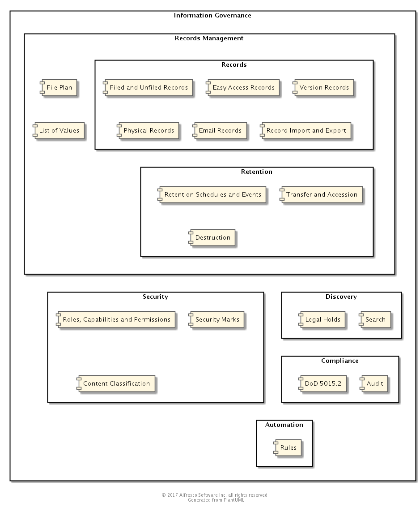

## Records Management Technical Overview

### Purpose
The Alfresco Records Management (RM) modules are installed on top of Alfresco Content Services and use a similar REST API and service architecture. This document provides an overview of the standard patterns that have been used throughout the RM modules.

*** 

### Overview 
RM is split into two main parts - a repository integration and a Share integration. The Share module communicates with the repository module using REST API calls. The repository module includes integration with the Alfresco database.

*** 

### Artifacts and Guidance

* [Community Source Code](https://github.com/Alfresco/records-management)
* [Enterprise Source Code](https://github.com/Alfresco/governance-services) (for partners and customers)
* [Community License](../LICENSE.txt)
* [Enterprise License](../../rm-enterprise/LICENSE.txt) (this file will only be present in clones of the Enterprise repository)
* [Issue Tracker Link](https://issues.alfresco.com/jira/projects/RM)
* [Community Documentation Link](https://support.hyland.com/access?dita:id=job1721300866386&vrm_version=26.1&component=Alfresco%20Governance%20Services%20Community%20Edition)
* [Enterprise Documentation Link](https://support.hyland.com/access?dita:id=job1721300866386&vrm_version=26.1)
* [Contribution Model](../../CONTRIBUTING.md)

*** 

### Prerequisite Knowledge
An understanding of Alfresco Content Services is assumed. The following pages from the [developer documentation](https://support.hyland.com/access?dita:id=lsl1724405261585&vrm_version=26.1&component=Alfresco%20Content%20Services%20Community%20Edition) give useful background information:

* [ACS Architecture](https://support.hyland.com/access?dita:id=lfo1719554691023&vrm_version=26.1)
* [Platform Extensions](https://support.hyland.com/access?dita:id=ifr1720080387005&vrm_version=26.1)
* [Share Extensions](https://support.hyland.com/access?dita:id=wqu1720687386891&vrm_version=26.1)

*** 

### APIs and Interfaces
The RM Share module communicates with the repository module via REST APIs. Internally the RM repository module uses a three layer model:

* A REST API layer responsible for converting API requests into service calls.
* A Java service layer responsible for handling business logic.
* A DAO layer responsible for CRUD operations against the database.

#### REST API
The REST API endpoints fall into two main types - v0 (Webscripts) and v1. The [v0 API](https://support.hyland.com/access?dita:id=fga1720080409048&vrm_version=26.1) is older and not recommended for integrations. The [v1 API](https://support.hyland.com/access?dita:id=cmm1721136574006&vrm_version=26.1) is newer but isn't yet feature complete. If you are running RM locally then the GS API Explorer will be available at [this link](http://localhost:8080/gs-api-explorer/).

Internally the GS v1 REST API is built on the [Alfresco v1 REST API framework](https://community.alfresco.com/community/ecm/blog/2016/10/11/v1-rest-api-part-1-introduction). It aims to be consistent with this in terms of behaviour and naming.

#### Java Public API
The Java service layer is fronted by a [Java Public API](https://support.hyland.com/access?dita:id=lol1721390191517&vrm_version=26.1), which we will ensure backward compatible with previous releases. Before we remove any methods there will first be a release containing that method deprecated to allow third party integrations to migrate to a new method.  The Java Public API also includes a set of POJO objects which are needed to communicate with the services. It is easy to identify classes that are part of the Java Public API as they are annotated `@AlfrescoPublicApi`.

Each Java service will have at least four beans defined for it:

* A 'lowerCase' inner bean, which is the actual service implementation.
* An 'UpperCase' wrapper bean, which includes security and transaction management. This is the bean that should be used by third party integrations.
* A bean to handle transactions on the service methods.
* A bean to handle security restricting who can call different service methods.

#### DAOs
The DAOs are not part of the Java Public API, but handle CRUD operations against RM stored data. We have some custom queries to improve performance for particularly heavy operations.

We use standard Alfresco [data modelling](https://support.hyland.com/access?dita:id=ekx1720080373621&vrm_version=26.1) to store RM metadata. We extend the [Alfresco patching mechanism](https://support.hyland.com/access?dita:id=ato1720080396825&vrm_version=26.1) to provide community and enterprise schema upgrades.

***

### Component Overview

***

### Design Decisions

| Decision        | Rationale                  | Date         |
| --------------- |:--------------------------:| ------------:|
|                 |                            |              |
