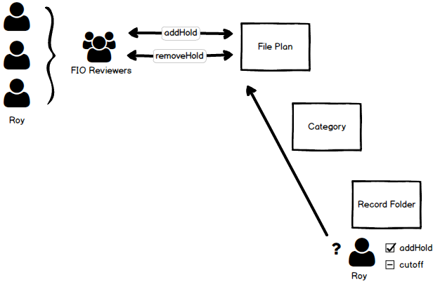

## Alfresco Governance Services' Roles and Capabilities

### Purpose

Roles and capabilities allow the GS system to provide a finer grain security evaluation, determining whether an authority has the capability to perform a perticular action on a node.

### Overview

Roles are defined as a collection of capabilities.  A capability, generally, has a one to one relationship with an action within the system.

Authorities are assigned roles.  If an authority is assigned to a role then it that authority has the capabilities contained within that role, allowing them to perform the related actions.

An authority can be assigned many roles, with the associated capabilities being additive.

Capabilties are evaluated in addition to any ACLs attached to a node, but they are mutally exclusive.  A authority may have the capability, but not the permissions on a node and vice versa.

### Design 

Roles are implementented as groups.  So for every role that is created, there is a corresponding group within the system.

Capabilities are implemented as permissions.  In order add a new capability to the system, the extended RM permission model needs to be extended.

When a capability is added to a role, then the capability group is assigned the capability role on the root file plan node.

In this way the permissions of the systems roles reflect their capabilities on the file plan via the capability permissions assigned.

When an authority is assigned to a role, that authority is added as a member of the corresponding role group.  In this way they inherit the capability permissions on the file plan that relate to that role group.

If a user attempts to perform an action on a records management artifact which has a related capability.  Assuming the user has permission to see the artifact in the first place, then the users capability to perform the action is evaluated.

This is done by firstly determining whether the capability is relevant for this 'kind' of records management artifact.  For example the addHold capability is not relevant for a record category.

Then the capability permission is evaluated by traversing to the file plan node and checking whether the current user has the capabilty permission byt virtue of it's membership of the right role group.

Finally any further conditions attached to the capability are evaluated.

