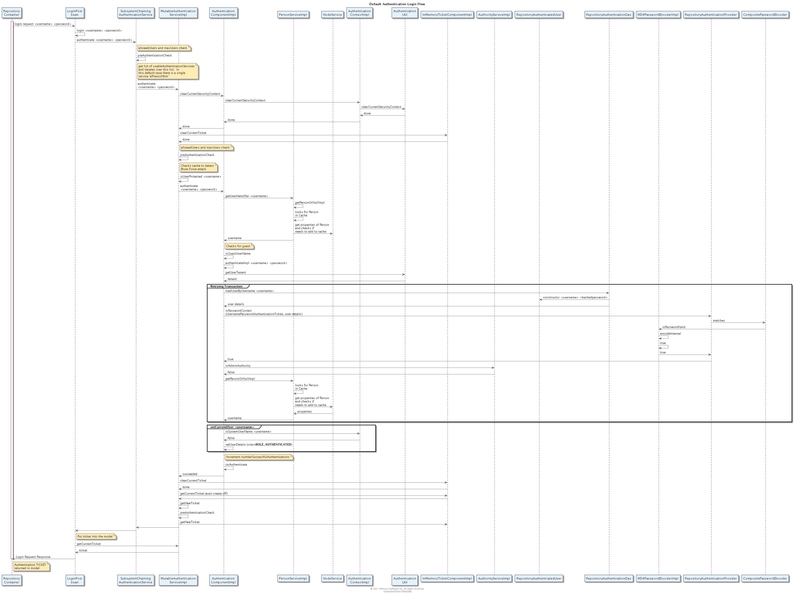
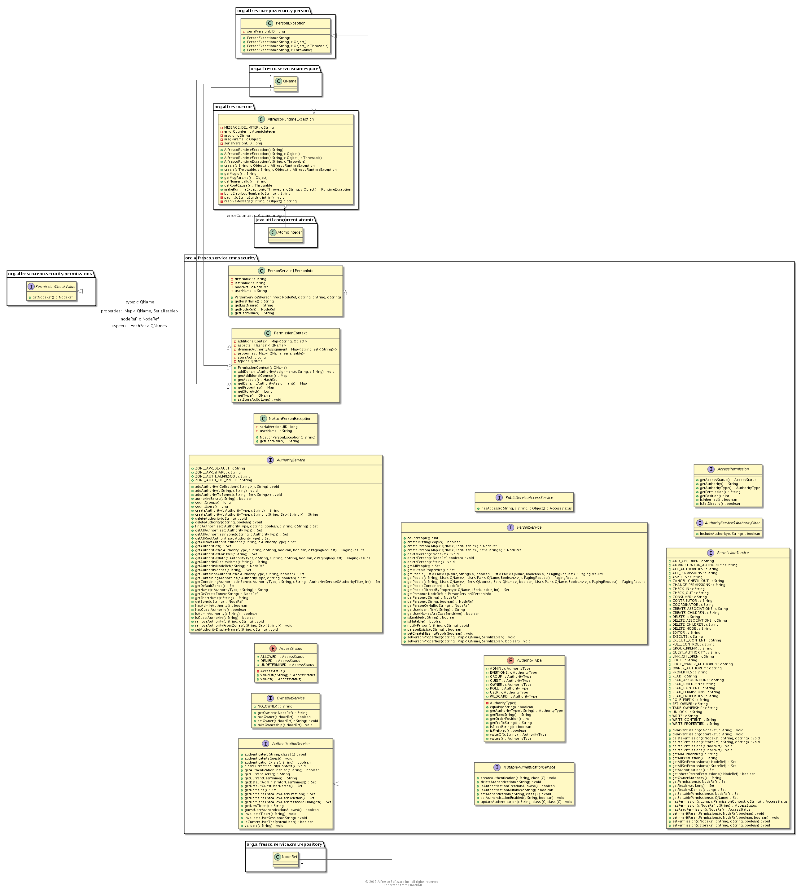

## Authentication

### Purpose

The purpose of this sub-component is to authenticate users.  
***

### Overview

In order to use any service in Alfresco, a user must be authenticated.  

Alfresco provides a default Authentication implementation that uses userid's and passwored
 managed by Alfresco.  But, importantly, Alfresco also allows the customer
to integrate with a number of external Authentication providers including
* Active Directory
* Kerberos
* NTLM
* LDAP

***

### Artifacts and Guidance

* Source Code Links:
  * https://svn.alfresco.com/repos/alfresco-enterprise/alfresco/HEAD/root/enterpriseprojects/repository/source/java/
  * https://github.com/Alfresco/alfresco-data-model/tree/master/src/main/java/org/alfresco/repo/security/authentication
* License: LGPL
* Issue Tracker Link: https://issues.alfresco.com/jira/issues/?jql=project%3DREPO
* Documentation Link: http://docs.alfresco.com/5.2/concepts/auth-intro.html
* Contribution Model: Alfresco Open Source
***

### Prerequisite Knowledge

* [Acegi](http://springinpractice.com/2008/02/26/acegi-overview)
* [CAS](https://en.wikipedia.org/wiki/Central_Authentication_Service)
* [JAAS](http://docs.oracle.com/javase/8/docs/technotes/guides/security/jaas/JAASRefGuide.html)
* [Kerberos](https://msdn.microsoft.com/en-us/library/bb742516.aspx)
* [LDAP](https://en.wikipedia.org/wiki/Lightweight_Directory_Access_Protocol)
* [NTLM](https://msdn.microsoft.com/en-us/library/windows/desktop/aa378749(v=vs.85).aspx)

***

### Design

#### Default Authentication

In order to use any service in Alfresco, a user or client must be authenticated.  

There is a default implementation provided that authenticates users based on a userid and password, where the userid's and passwords
are stored in the Alfresco repository.

#### Chaining

Most production systems that use Alfresco will rely upon more secure approaches, so Alfresco also allows the
customer to integrate a choice of existing authentication providers, including *Active Directory*, *Kerberos*, *LDAP* and *NTLM*.  

The implementation of each such Authorization provider is delivered as a separate Alfresco Subsystem.  
The Subsystems are chained together as an ordered list of providers each of which, in turn, will be given
a chance to authenticate the user, until the user is authenticated or there are no providers, in
which case the authentication of the user fails.

#### Component Model

#### Data Model

#### Data Dictionary

#### Flows

##### Login Flow

##### Default Authentication Login Flow
This flow starts when the Login Post request
depicted in [Client Login](../../../share/share-app/resource/sequence/client-login-sequence.png) reaches the repository tier.

##### Default Authentication Logoff Flow

##### Kerberos Authentication Login Flow

##### NTLM Authentication Login Flow

#### Class Diagram

### APIs and Interfaces

#### Java

The sub-component provides a definition and implementation of the following
Java interfaces.

* **Authentication Service**
**Note**: This service is part of the Public API
  * authenticate using a user name and password
  * authenticate using a ticket
  * create, update and delete authentication information
  * clear the current authentication
  * invalidate a ticket
  * get the username for who is currently authenticated
  * get a ticket for subsequent re-authentication
  * determine if the current user is 'the system user
* **MutableAuthenticationService*

In addition, there are a number of related interfaces that provide
a way to manage users and groups and permissions

*This information should probably move to the Identity sub-component after the content already there (future design thoughts)
is relocated*

* **Authority Service**  
**Note**: This service is part of the Public API
  * create authority identifiers
  * query for authority identifiers
  * delete authority identifiers
  * organize authority identifiers into hierarchies
  * query against authority identifiers hierarchies
  * find all the authorties that apply to the current authenticated user
  * determine if the current authenticated user has admin rights
* **Ownable Service**  
**Note**: This service is **not** part of the Public API
  * determine the owner of a node;
  * set the owner of a node;
  * determine if a node has an owner
  * allow the current user to take ownership of a node
* **Person Service**  
  **Note**: This service is part of the Public API
  * obtain a reference to the Person node for a given user name
  * determine if a person entry exists for a user
  * create missing people entries, with default settings, on demand
  * supply a list of mutable properties for each person
  * create, delete and update personal information
***
#### REST

The sub-component provides the following REST API
* https://api-explorer.alfresco.com/api-explorer/#/authentication

### Configuration
***

### Performance Considerations

Describe Caching of tickets
As mentioned in the *Security Considerations* section, Bcrypt can be used to encrypt passwords.  Note that is
is much slower than MD4 or SHA-256.
***

### Security Considerations
***
In the case of the default Authentication provider, Alfresco is responsible for storing
userid's and passwords.   The passwords are stored as hashed values.  The default hashing
algorithm used is MD4, but the customer can also elect to use more secure hashing algorithms
include SHA-256 and Bcrypt.  The system property *system.preferred.password.encoding* is used
to select which algorithm is used.  

### Cloud Considerations

Describe OAuth2 for protection of Cloud REST API's.
***
