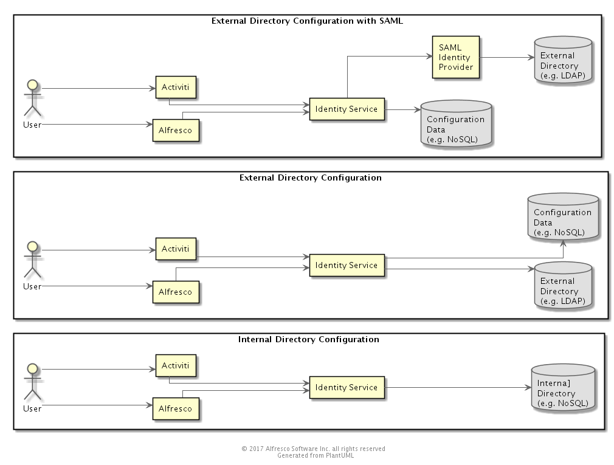
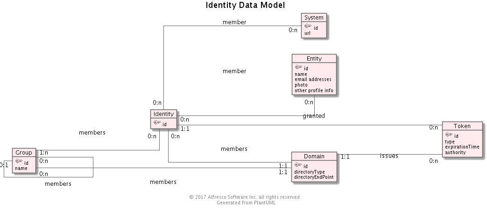
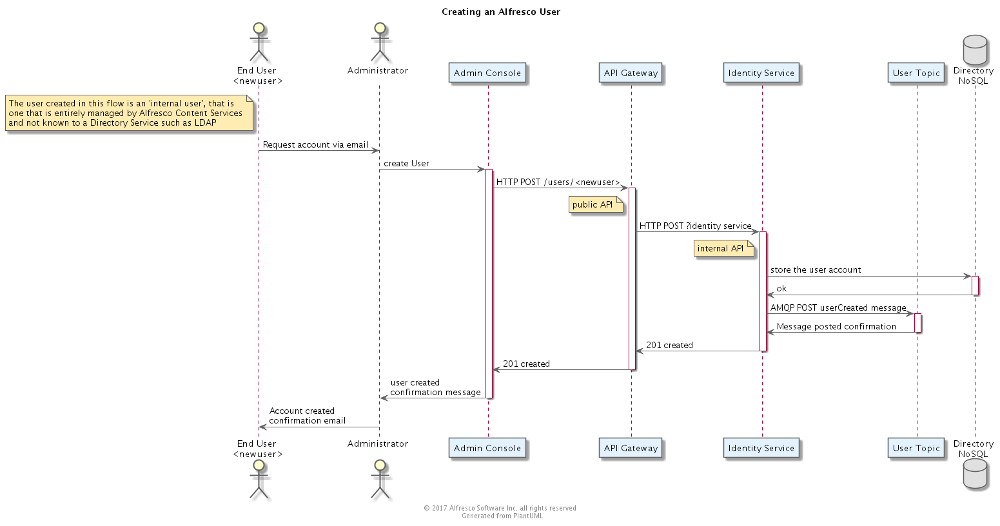
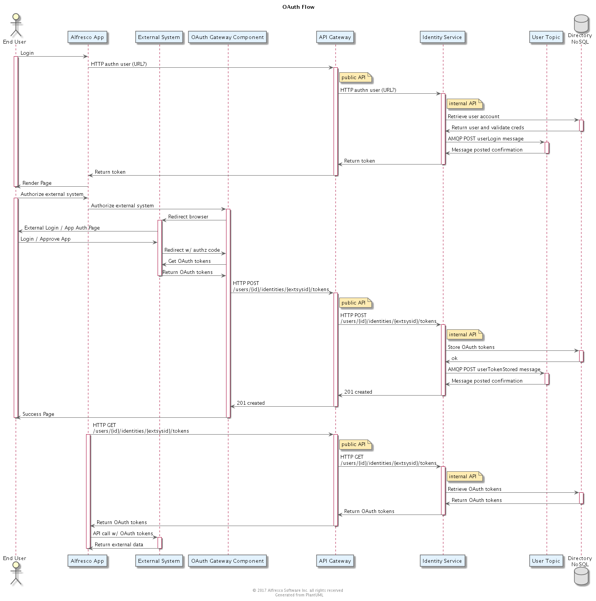
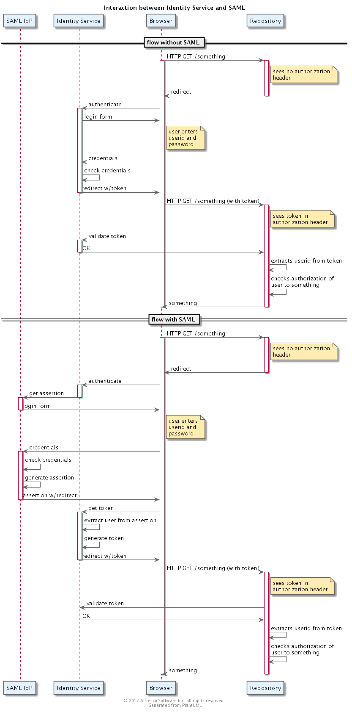
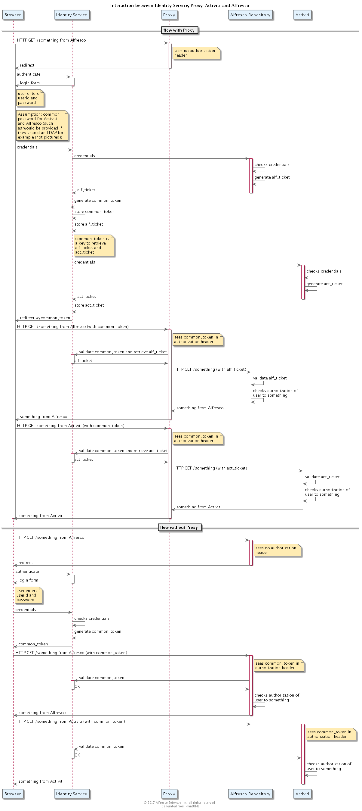

## Identity

### Purpose
The Identity Component manages the directory of entities (users, groups and systems) that can use Alfresco services, and is also responsible for authenticating such entities. 

*** 

### Overview 

*** 

### Artifacts and Guidance

* Source Code Link:  https://github.com/Alfresco/identity-service
* License: LGPL
* Issue Tracker Link: https://issues.alfresco.com/jira/projects/ID
* Documentation Link: 
* Contribution Model: Alfresco Closed Source

*** 

### Prerequisite Knowledge

*** 

### Design

#### Open Source Offerings

Several Open Source offerings exist in this space.  These can be reviewed as possible aternatives for us developing our own implementation.

*** 

##### Keystone
 
Keystone is the Identity Service used in the OpenStack Platform.   It is written in Python.  It provides Authentication and Authorization services, but not User Profile Management services. 

Source: https://github.com/openstack/keystone

License: Apache 2.0

Documentation: http://docs.openstack.org/developer/keystone/

*** 

##### Keycloak

Keycloak is the Identity Service developed by Red Hat.   It is written in Java.  It provides Authentication, Authorization services, and User Profile Management services. 

Source: https://github.com/keycloak/keycloak

License: Apache 2.0

Documentation: http://www.keycloak.org/documentation.html

*** 

##### Syncope

Syncope is an Identity Service from Apache.  

* Written in Java
* Deployed as a set of three war files
* Tested with Tomcat, Glassfish, Payara, Wildfly app servers
* Tested with PostgreSQL, MariaDB, MySQL, Oracle and MS SQL
* Provides User Profile Management Services
* Provides User Authentication Services including both an internal (self-contained) directory as well as integration with external directory systems
* Integrates with Activiti for a user provisioning workflow (see https://syncope.apache.org/apidocs/2.0/org/apache/syncope/core/workflow/activiti/spring/package-frame.html)
* Provides a full REST API, with a Swagger definition file
* Provides an admin console

Source: https://git-wip-us.apache.org/repos/asf/syncope.git 

License: Apache 2.0

Documentation: https://syncope.apache.org/docs/index.html

***

##### SCIM

An implementation of SCIM would be a UPM system that seems to satisfy the user stories defined in https://issues.alfresco.com/jira/browse/ID-1. 
There are [a number of such implementations](http://www.simplecloud.info), 16 of which are open source implementations.

Greg Melahn assessed SCIM in 2013.  See [Architecture Notes](https://docs.google.com/a/alfresco.com/document/d/1JmHrd1AYWn2dyU43_FnFg2XQ69ktn7EIPKpDE3YAjAA/edit?usp=sharing)

***

#### Component Model

There are three principal configurations supported by the Identity Service

1.  Internal Directory

This is the out of the box configuration in which the service persists content in a database.   
2.  External Directory

In this configuration the Identity Service is configured to delegate authentication and user profile storage to an external 
service such as LDAP.  A database is still used to store configuration data.
3.  SAML

In this configuration the Identity Service is configured to delegate authentication and user profile storage to a SAML IdP. 
In this configuration the Identity Service is viewed by the IdP as a Service Provider.

These configurations are illustrated below.

#### Data Model

The following are the elements of the Data Model
* **Entity**
This represents the actual person, identified by a guid issued by the Identity Service.
* **User**
This is the user as it is known to an instance of Alfresco or to a system, like Box, that is integrated with Alfresco.  A *User* is associated with one, and only one, *Entity*.  A *User* is a member of at least one *Group*, and may be a member of multiple *Groups*.
* **Group**
This is a collection of *Users* or other *Groups*.  A *Group* may only be a member of one *Group*.  Each *Domain* has at least one *Group*, known as *ALL*, which has no parent.
* **Domain**
This represents a Directory, which may either be external (such as an LDAP) or internal (Alfresco).
* **Token**
This is something issued to a *User* that certifies that the *User* has been authenticated 
by a *Domain*.  Typically the Domain is an external system such as an LDAP which is responsible for
issuing the token.
In the case where Alfresco is authenticating the user because there is no associated external service, the token is issued by the Identity Service
* **System**
This represents the system to which the *User* is associated, such as "Box", "Salesforce" or "Alfresco Cloud".  

 Do we really need both *System* and *Domain*?

#### Data Dictionary

Not applicable

#### Flows
##### Add a User using Alfresco Admin 

##### OAuth Flow (Alfresco and Box for example)

##### SAML Flow (The Identity Service uses a SAML IdP for authentication)
This is a somewhat simplified flow in that interactions with the Queuing system are
omitted  

##### Use of a Proxy to Manage Alfresco and Activiti tokens 
As an interim approach, Mario has proposed the introduction of a proxy that sits in front of both Alfresco and
Activiti to trigger a flow that would cause the Identity service to collect credentials from the 
user, collect an alf and act token from Alfresco and Activity using those credentials and then store the tokens
with a generated common token that the client could pass-back as proof of authentication.  

The purpose of the proxy in this flow, is to allow the use of the Identity Service in *current* deployments of Alfresco
and Activity where there is no opportunity to update Alfresco or Activiti.

#### Class Diagram

*** 

### APIs and Interfaces

#### REST API
 Gav to provide a proposal for the CRUD part of this API.

NOTE: This API does not match the data model above, alternative proposed data model diagram TBD.

GET /users 

POST /users <- Something close to the [SCIM](http://www.simplecloud.info/specs/draft-scim-core-schema-01.html#anchor8) user representation

GET /users/{id} -> Something close to the [SCIM](http://www.simplecloud.info/specs/draft-scim-core-schema-01.html#anchor8) user representation

GET /users/{id}/groups

GET /users/{id}/identities

GET /users/{id}/tokens (validate token only, checks all identities for user)

PUT & PATCH /users/{id}

DELETE /users/{id}

GET /groups

POST /groups 

GET /groups/members

POST /groups/members

POST /tokens

##### Examples

<pre>
POST /users
{
  "userName": "gcornwell",
  "name": {
    "formatted": "Mr. Gavin Paul Cornwell",
    "familyName": "Cornwell",
    "givenName": "Gavin",
    "middleName": "Paul",
    "honorificPrefix": "Mr."
  },
  "displayName": "Gavin Cornwell",
  "emails": [
    {
      "value": "gavin.cornwell@alfresco.com",
      "type": "work",
      "primary": true
    }
  ],
  "identities": [
    {
      "systemId": "box",
      "externalId": "gavinc",
      "token": "e9e30dba-f08f-4109-8486-d5c6a331660a"
    }
  ]
}
</pre>

*** 

### Configuration

*** 

### Performance Considerations

*** 

### Security Considerations

*** 

### Cloud Considerations

***

### Design Questions and Decisions

|  Question        | Decision               | Rationale                  | Date         |
| :----------------|:-----------------------| --------------------------:| ------------:|
| Should we start with existing Open Source (e.g. Keycloak) 
| 

***

### Quiz

