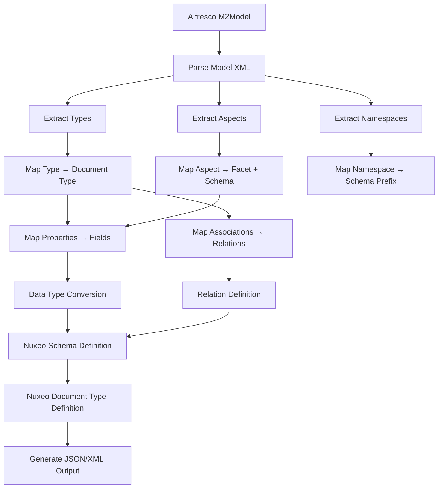

# Alfresco to Nuxeo Data Model Mapping Investigation

## Executive Summary

This document provides a comprehensive analysis of mapping between Alfresco's data model and Nuxeo's data model. Both systems are enterprise content management platforms that use metadata-driven architectures, but they employ different approaches to modeling content types, properties, and relationships.

**Key Findings:**
- Both systems support hierarchical type inheritance and reusable metadata schemas
- Alfresco's Aspects map conceptually to Nuxeo's Facets + Schemas combination
- Property data types require careful conversion between the two systems
- Association handling differs significantly between the platforms
- Dynamic behavior capabilities vary between systems

**Complexity Rating:** Medium-High
**Feasibility:** High (with documented limitations)
**Recommended Approach:** Automated mapping with manual review for complex cases

---

## 1. Alfresco Data Model Overview

### 1.1 Core Concepts

Alfresco's data model is defined using XML configuration files that follow the Dictionary Model schema. The model is built on several key concepts:

#### Types (M2Type)
- **Definition**: Content types define the structure and behavior of content items
- **Inheritance**: Single inheritance from parent types (ultimately from `cm:content` or `cm:folder`)
- **Components**: Properties, associations, and mandatory aspects
- **Example**: `cm:content` → `cm:document` → Custom document types

#### Aspects (M2Aspect)
- **Definition**: Reusable cross-cutting behaviors that can be applied to any type
- **Flexibility**: Can be added/removed dynamically at runtime
- **Use Cases**: Versioning (`cm:versionable`), tagging (`cm:taggable`), auditing (`cm:auditable`)
- **Multiple Application**: Multiple aspects can be applied to a single node

#### Properties (M2Property)
- **Definition**: Metadata fields associated with types and aspects
- **Characteristics**:
  - Data type (d:text, d:int, d:date, d:content, etc.)
  - Mandatory/optional flag
  - Multi-valued support
  - Default values
  - Constraints (regex, list, min/max, etc.)
  - Indexing configuration
- **Example**: `cm:name`, `cm:title`, `cm:description`

#### Associations (M2Association)
- **Child Associations**: Parent-child hierarchical relationships (contain/containment)
  - Example: Folder contains documents
  - Cascade delete behavior
  - Primary vs. secondary children
- **Peer Associations**: Non-hierarchical references between nodes
  - Example: Document references related documents
  - No cascade behavior
  - Many-to-many relationships

#### Namespaces (M2Namespace)
- **Purpose**: Model isolation and prefix management
- **Structure**: URI + prefix mapping
- **Example**: `http://www.alfresco.org/model/content/1.0` → `cm`

#### Constraints (M2Constraint)
- **Types**: REGEX, LIST, MINMAX, LENGTH
- **Scope**: Property-level validation
- **Enforcement**: Can be strict or advisory

### 1.2 Key Classes Structure

```
M2Model
├── name, description, author, version
├── namespaces (List<M2Namespace>)
├── imports (List<M2Namespace>)
├── types (List<M2Type>)
│   └── extends M2Class
│       ├── properties (List<M2Property>)
│       ├── associations (List<M2Association>)
│       ├── childAssociations (List<M2ChildAssociation>)
│       └── mandatoryAspects (List<String>)
├── aspects (List<M2Aspect>)
│   └── extends M2Class
└── constraints (List<M2Constraint>)
```

### 1.3 Example Alfresco Model

```xml
<model name="custom:model" xmlns="http://www.alfresco.org/model/dictionary/1.0">
  <namespaces>
    <namespace uri="http://example.com/model/custom/1.0" prefix="custom"/>
  </namespaces>
  
  <types>
    <type name="custom:invoice">
      <parent>cm:content</parent>
      <properties>
        <property name="custom:invoiceNumber">
          <type>d:text</type>
          <mandatory>true</mandatory>
          <index enabled="true"/>
        </property>
        <property name="custom:invoiceDate">
          <type>d:date</type>
          <mandatory>true</mandatory>
        </property>
        <property name="custom:amount">
          <type>d:double</type>
        </property>
      </properties>
      <mandatory-aspects>
        <aspect>cm:versionable</aspect>
      </mandatory-aspects>
    </type>
  </types>
  
  <aspects>
    <aspect name="custom:paymentInfo">
      <properties>
        <property name="custom:paymentMethod">
          <type>d:text</type>
          <constraints>
            <constraint type="LIST">
              <parameter name="allowedValues">
                <list>
                  <value>Credit Card</value>
                  <value>Bank Transfer</value>
                  <value>Cash</value>
                </list>
              </parameter>
            </constraint>
          </constraints>
        </property>
      </properties>
    </aspect>
  </aspects>
</model>
```

---

## 2. Nuxeo Data Model Overview

### 2.1 Core Concepts

Nuxeo's data model is based on a flexible schema architecture that combines document types, schemas, and facets.

#### Document Types
- **Definition**: Primary type defining a document's structure
- **Inheritance**: Single inheritance hierarchy from core types
- **Core Types**: Document, File, Folder, Workspace, etc.
- **Composition**: Combines multiple schemas
- **Example**: `Document` → `File` → Custom file types

#### Schemas
- **Definition**: Named groups of related fields (properties)
- **Reusability**: Can be attached to multiple document types
- **Prefixes**: Each schema has a prefix for field naming
- **Core Schemas**: `dublincore`, `file`, `common`, etc.
- **Example**: `file` schema contains `file:content`, `file:filename`

#### Facets
- **Definition**: Markers that enable behaviors and attach schemas
- **Purpose**: Similar to Alfresco aspects - provide mixins
- **Characteristics**:
  - Can include schemas
  - Enable specific behaviors
  - Declarative application (not always dynamic)
- **Examples**: `Versionable`, `Commentable`, `Publishable`

#### Fields
- **Definition**: Individual metadata properties within schemas
- **Types**: string, long, boolean, date, blob, complex types
- **Multi-valued**: Array types supported with `[]` notation
- **Constraints**: Validation rules and constraints can be defined
- **Example**: `dc:title`, `dc:description`, `file:content`

#### Relations
- **Definition**: Links between documents
- **Types**: Unidirectional or bidirectional
- **Graph-based**: More flexible than hierarchical containment
- **Use Cases**: Document references, dependencies, relationships

### 2.2 Core Document Types Hierarchy

```
Document (base)
├── File
│   ├── Picture
│   ├── Video
│   └── Audio
├── Folder
│   ├── OrderedFolder
│   └── Workspace
├── Note
└── Domain
```

### 2.3 Schema Structure

```json
{
  "name": "invoice",
  "prefix": "inv",
  "fields": {
    "invoiceNumber": {
      "type": "string",
      "required": true,
      "indexed": true
    },
    "invoiceDate": {
      "type": "date",
      "required": true
    },
    "amount": {
      "type": "double"
    },
    "lineItems": {
      "type": "complex[]",
      "properties": {
        "description": "string",
        "quantity": "long",
        "unitPrice": "double"
      }
    }
  }
}
```

### 2.4 Facet Structure

```json
{
  "name": "PaymentInfo",
  "schemas": ["payment"],
  "docType": "applicable to specific types or all"
}
```

---

## 3. Detailed Comparison Tables

### 3.1 Entity Mapping

| Alfresco Concept | Nuxeo Equivalent | Mapping Strategy | Notes |
|------------------|------------------|------------------|-------|
| **Type (M2Type)** | **Document Type** | Direct mapping with hierarchy preservation | Both support single inheritance |
| **Aspect (M2Aspect)** | **Facet + Schema** | Aspect → Facet (behavior) + Schema (properties) | Facets are less dynamic than aspects |
| **Property (M2Property)** | **Field** | Map to schema field with type conversion | Data type mapping required |
| **Child Association** | **Parent-Child Containment** | Map to document hierarchy | Nuxeo uses parent/child relationships |
| **Peer Association** | **Relation** | Map to Relation object | Requires relation graph |
| **Namespace** | **Schema Prefix** | URI → prefix mapping | Namespace becomes schema identifier |
| **Constraint** | **Validation Rule** | Map to field validators | Different constraint systems |
| **Mandatory Aspect** | **Required Facet** | Include in document type definition | May need manual application |

### 3.2 Property/Field Mapping

| Alfresco Data Type | Nuxeo Data Type | Conversion Logic | Considerations |
|-------------------|-----------------|------------------|----------------|
| `d:text` | `string` | Direct mapping | No conversion needed |
| `d:mltext` | `string` | Convert to single string or use i18n | May lose multi-language structure |
| `d:int` | `long` | Direct mapping (widening) | Nuxeo uses long for integers |
| `d:long` | `long` | Direct mapping | Perfect match |
| `d:float` | `double` | Direct mapping (widening) | Precision consideration |
| `d:double` | `double` | Direct mapping | Perfect match |
| `d:boolean` | `boolean` | Direct mapping | Perfect match |
| `d:date` | `date` | Direct mapping | Date only (no time) |
| `d:datetime` | `date` | Direct mapping | Nuxeo date includes time |
| `d:content` | `blob` | Map to blob reference | Binary content handling |
| `d:noderef` | `string` | Store as document ID/path string | Validation required |
| `d:qname` | `string` | Serialize QName to string | Format: `{uri}localName` or `prefix:localName` |
| `d:path` | `string` | Convert path to string | Repository path format |
| `d:category` | `string` | Map to category ID/name | May need category lookup |
| `d:any` | `string` | Default to string | Type-specific handling needed |
| `d:locale` | `string` | Locale code string | Format: `en_US`, `fr_FR` |
| `d:content[multiple]` | `blob[]` | Array of blobs | Multi-valued support |
| Any `[multiple]` | `type[]` | Array type in Nuxeo | Nuxeo supports multi-valued fields |

### 3.3 Association Mapping

| Alfresco Association Type | Nuxeo Equivalent | Mapping Approach | Cardinality |
|---------------------------|------------------|------------------|-------------|
| **Child Association (1:N)** | **Parent/Child** | Document hierarchy | One parent, many children |
| **Primary Child** | **Main parent** | Set as document parent | Single primary parent |
| **Secondary Child** | **Additional containment** | Use relation or folder link | Multiple containers possible |
| **Peer Association (1:1)** | **Relation (1:1)** | Create directed relation | Single target |
| **Peer Association (1:N)** | **Relation (1:N)** | Create multi-valued relation | Multiple targets |
| **Peer Association (N:M)** | **Relation (N:M)** | Bidirectional relations | Many-to-many |

### 3.4 Namespace Mapping

| Alfresco Namespace | Suggested Nuxeo Schema | Prefix | Notes |
|--------------------|------------------------|--------|-------|
| `http://www.alfresco.org/model/content/1.0` | Built-in equivalent schemas | `cm` → varies | Map to `dublincore`, `common`, `file` |
| `http://www.alfresco.org/model/system/1.0` | System schemas | `sys` | Internal system properties |
| `http://www.alfresco.org/model/dictionary/1.0` | Model metadata | `d` | Data type definitions |
| Custom namespace URIs | Custom schemas | Custom prefix | Preserve original prefix |

### 3.5 Constraint Mapping

| Alfresco Constraint | Nuxeo Validation | Implementation | Limitations |
|--------------------|------------------|----------------|-------------|
| **REGEX** | Pattern validator | Regex pattern | Direct mapping |
| **LIST** | Enum/vocabulary | Allowed values list | Directory/vocabulary system |
| **MINMAX** | Range validator | Min/max values | Numeric fields only |
| **LENGTH** | String length validator | Min/max length | String fields only |
| **MANDATORY** | Required field | Field metadata | Built-in support |
| **Custom constraint** | Custom validator | Java validator class | Requires code implementation |

---

## 4. Key Differences and Challenges

### 4.1 Architectural Differences

#### Type System
- **Alfresco**: Type + Multiple Aspects (additive model)
- **Nuxeo**: Document Type + Facets + Schemas (compositional model)
- **Impact**: Aspects are more dynamic; facets are more declarative

#### Property Organization
- **Alfresco**: Properties directly on types/aspects
- **Nuxeo**: Properties grouped in schemas, schemas attached to types
- **Impact**: Need to create schemas for aspect properties

#### Association Model
- **Alfresco**: Built-in child/peer associations with metadata
- **Nuxeo**: Relations are separate graph structures
- **Impact**: Different querying and traversal patterns

### 4.2 Dynamic Behavior Differences

| Feature | Alfresco | Nuxeo | Gap |
|---------|----------|-------|-----|
| **Dynamic aspect/facet application** | Runtime add/remove | Limited dynamic application | Nuxeo facets more static |
| **Property override** | Supported in type hierarchy | Supported with override flag | Similar capability |
| **Multi-tenancy** | Built-in namespace isolation | Domain-based separation | Different approaches |
| **Cascade delete** | Child associations cascade | Parent/child cascade | Similar behavior |
| **Property inheritance** | Full inheritance chain | Schema-based inheritance | Different mechanisms |

### 4.3 Data Type Challenges

1. **Multi-lingual Text (d:mltext)**
   - Alfresco: Native support with locale map
   - Nuxeo: No direct equivalent; use i18n schemas or separate fields
   - **Solution**: Create locale-specific fields or use single string with language tags

2. **NodeRef References**
   - Alfresco: Strongly typed node references
   - Nuxeo: Document IDs or paths as strings
   - **Solution**: Store document ID with validation; maintain referential integrity manually

3. **QName Types**
   - Alfresco: Qualified names with namespace resolution
   - Nuxeo: Plain strings
   - **Solution**: Serialize as `prefix:localName` or `{uri}localName`

4. **Content Properties**
   - Alfresco: ContentData with URL, mimetype, size, encoding
   - Nuxeo: Blob with similar metadata
   - **Solution**: Map ContentData metadata to blob properties

### 4.4 Functional Gaps

| Capability | Alfresco | Nuxeo | Mitigation |
|------------|----------|-------|------------|
| **Dynamic aspect addition** | Full support | Limited | Pre-define all possible facets |
| **Association metadata** | Properties on associations | Limited relation metadata | Store in related document |
| **Mandatory aspects** | Enforced by type definition | Facets included in type | Include facet in doc type |
| **Property indexing control** | Fine-grained per property | Schema-level configuration | Configure at schema level |
| **Constraint parameters** | Rich parameter system | Simpler validation | May need custom validators |

---

## 5. Mapping Logic Documentation

### 5.1 High-Level Mapping Process



### 5.2 Type Mapping Algorithm

1. **Extract Alfresco Type**:
   ```
   - Parse type name (QName)
   - Get parent type
   - Get properties list
   - Get associations list
   - Get mandatory aspects
   ```

2. **Create Nuxeo Document Type**:
   ```
   - Map type name (preserve prefix:localName)
   - Set parent document type
   - Create schema from type properties
   - Include schemas from mandatory aspects
   - Add facets for mandatory aspects
   ```

3. **Handle Inheritance**:
   ```
   - Resolve parent type chain
   - Inherit properties and schemas
   - Preserve hierarchy in Nuxeo
   ```

### 5.3 Aspect Mapping Algorithm

1. **Extract Alfresco Aspect**:
   ```
   - Parse aspect name (QName)
   - Get properties list
   - Get associations list
   - Determine if mandatory or optional
   ```

2. **Create Nuxeo Facet + Schema**:
   ```
   - Create facet with aspect name
   - Create schema with aspect prefix
   - Add properties as schema fields
   - Link schema to facet
   ```

3. **Dynamic Application**:
   ```
   - For optional aspects: create facet for manual application
   - For mandatory aspects: include in document type definition
   ```

### 5.4 Property Mapping Algorithm

1. **Extract Property Metadata**:
   ```
   - Property name
   - Data type
   - Mandatory flag
   - Multi-valued flag
   - Default value
   - Constraints
   - Indexing configuration
   ```

2. **Convert to Nuxeo Field**:
   ```
   - Map data type using conversion table
   - Set required flag
   - Handle multi-valued with array type
   - Set default value
   - Convert constraints to validators
   ```

3. **Handle Special Cases**:
   ```
   - d:mltext → Create i18n structure or single string
   - d:noderef → Store as document ID string
   - d:content → Map to blob with metadata
   - d:qname → Serialize to string format
   ```

### 5.5 Association Mapping Algorithm

1. **Child Association Mapping**:
   ```
   - Identify primary vs. secondary
   - Map to parent/child relationship
   - Preserve containment semantics
   - Handle cascade delete
   ```

2. **Peer Association Mapping**:
   ```
   - Create Relation definition
   - Map source and target types
   - Set cardinality (1:1, 1:N, N:M)
   - Determine directionality
   ```

### 5.6 Example Code Flow

```java
// Pseudo-code for mapping process
M2Model alfrescoModel = M2Model.createModel(xmlInputStream);

NuxeoDataModelMapper mapper = new NuxeoDataModelMapper();
MappingContext context = new MappingContext();

// Map types
for (M2Type type : alfrescoModel.getTypes()) {
    NuxeoDocumentType nuxeoType = mapper.mapType(type, context);
    context.addDocumentType(nuxeoType);
}

// Map aspects
for (M2Aspect aspect : alfrescoModel.getAspects()) {
    NuxeoFacet facet = mapper.mapAspect(aspect, context);
    NuxeoSchema schema = mapper.createSchemaFromAspect(aspect, context);
    context.addFacet(facet);
    context.addSchema(schema);
}

// Generate output
String jsonOutput = context.toJSON();
```

---

## 6. Unresolved Issues and Limitations

### 6.1 Critical Issues

#### Issue #1: Dynamic Aspect Application (Severity: HIGH)
- **Description**: Alfresco allows aspects to be added/removed at runtime. Nuxeo facets are typically defined at document type level and are less dynamic.
- **Impact**: Loss of runtime flexibility for applying optional metadata schemas
- **Workaround**: 
  - Pre-define all possible facets on document types
  - Use schema field nullability for optional properties
  - Consider custom lifecycle state-based approach
- **Recommendation**: Evaluate if Nuxeo's dynamic facet capabilities (if available in version) can support this

#### Issue #2: Multi-lingual Text (Severity: MEDIUM)
- **Description**: Alfresco's `d:mltext` stores multiple language variants in a single property. Nuxeo lacks direct equivalent.
- **Impact**: Potential data loss or complex schema design for multi-language content
- **Workaround**:
  - Create separate fields per language (e.g., `title_en`, `title_fr`)
  - Store as JSON string with language map
  - Use Nuxeo's i18n capabilities if available
- **Recommendation**: Analyze actual multi-language usage patterns before deciding

#### Issue #3: NodeRef Type Safety (Severity: MEDIUM)
- **Description**: Alfresco's `d:noderef` provides type-safe references with existence validation. Nuxeo uses string IDs.
- **Impact**: Loss of referential integrity enforcement at data model level
- **Workaround**:
  - Store as string with validation
  - Implement custom validators for document existence
  - Use relations for strong references
- **Recommendation**: Implement application-level referential integrity checks

### 6.2 Moderate Issues

#### Issue #4: Association Cardinality Enforcement (Severity: MEDIUM)
- **Description**: Alfresco enforces association cardinality (many flags). Nuxeo relations may have different enforcement.
- **Impact**: Potential for violating cardinality constraints
- **Workaround**: Implement application-level validation
- **Recommendation**: Document cardinality requirements; validate in business logic

#### Issue #5: Constraint Parameters (Severity: MEDIUM)
- **Description**: Alfresco constraints support rich parameters (regex, lists, ranges). Nuxeo validators may be simpler.
- **Impact**: Some validation logic may need to be implemented in code
- **Workaround**: Create custom validators for complex constraints
- **Recommendation**: Catalog all constraint types used; prioritize common ones

#### Issue #6: Property Indexing Configuration (Severity: MEDIUM)
- **Description**: Alfresco allows fine-grained indexing control per property. Nuxeo may have different indexing model.
- **Impact**: Search performance and capabilities may differ
- **Workaround**: Configure indexing at schema or document type level
- **Recommendation**: Review search requirements; adjust indexing strategy

### 6.3 Minor Issues

#### Issue #7: Namespace Isolation (Severity: LOW)
- **Description**: Alfresco's namespace URIs provide strong model isolation. Nuxeo schema prefixes are simpler.
- **Impact**: Potential naming conflicts if multiple schemas use same prefix
- **Workaround**: Enforce unique schema prefix conventions
- **Recommendation**: Establish naming standards to avoid conflicts

#### Issue #8: Custom Data Types (Severity: LOW)
- **Description**: Alfresco supports custom data types. Nuxeo may have limited custom type support.
- **Impact**: Custom types must be mapped to standard Nuxeo types
- **Workaround**: Map to closest standard type; use complex types for structures
- **Recommendation**: Document custom type mappings; validate with examples

#### Issue #9: Property Override Semantics (Severity: LOW)
- **Description**: Property override behavior may differ between systems
- **Impact**: Inherited property behavior may not match exactly
- **Workaround**: Test override scenarios; document differences
- **Recommendation**: Review type hierarchies for overrides

#### Issue #10: Archive and Soft Delete (Severity: LOW)
- **Description**: Archive mechanisms differ (Alfresco archive store vs. Nuxeo trash)
- **Impact**: Archived content handling requires custom logic
- **Workaround**: Map to Nuxeo trash or implement custom archive
- **Recommendation**: Design archive strategy during migration planning

### 6.4 Investigation Needed

The following areas require further investigation:

1. **Nuxeo Version-Specific Features**: Document which Nuxeo version is target; features vary by version
2. **Complex Type Support**: Investigate Nuxeo's complex/composite type capabilities for nested structures
3. **Transaction Boundaries**: Understand how association creation interacts with transactions
4. **Event Model**: Compare event/behavior triggers between systems
5. **Security Model**: Evaluate if Alfresco permission aspects map to Nuxeo ACLs
6. **Versioning Semantics**: Compare versioning behavior and configuration
7. **Workflow Integration**: Assess if content model affects workflow definitions
8. **Thumbnail Generation**: Check if rendition aspects need special handling
9. **Full-Text Extraction**: Understand content extraction configuration differences
10. **Audit Trail**: Evaluate audit aspect mapping to Nuxeo audit system

---

## 7. Recommendations

### 7.1 Migration Strategy

1. **Phased Approach**:
   - Phase 1: Core types and simple properties
   - Phase 2: Aspects and facets
   - Phase 3: Associations and relations
   - Phase 4: Constraints and validation
   - Phase 5: Advanced features and optimizations

2. **Validation Process**:
   - Generate mapping reports for each model
   - Review mappings with domain experts
   - Test with sample documents
   - Validate search and query patterns
   - Performance test with realistic data volumes

3. **Fallback Strategy**:
   - Maintain original Alfresco model metadata for reference
   - Store unmappable properties in extension schema
   - Document manual mapping decisions
   - Create migration log for audit trail

### 7.2 Technical Recommendations

1. **Prototype First**: Build proof-of-concept with representative models
2. **Automated Testing**: Create comprehensive test suite for mappings
3. **Documentation**: Maintain detailed mapping documentation
4. **Validation**: Implement validation layer for data integrity
5. **Monitoring**: Add logging and metrics for mapping operations
6. **Extensibility**: Design for custom mapping rules and overrides

### 7.3 Code Quality Standards

1. **Follow Alfresco coding conventions**
2. **Comprehensive JavaDoc for all public APIs**
3. **Unit test coverage >80%**
4. **Integration tests for realistic scenarios**
5. **Error handling and meaningful error messages**
6. **Logging at appropriate levels (DEBUG, INFO, WARN, ERROR)**
7. **Configuration externalization**
8. **Thread-safety considerations**

### 7.4 Operational Recommendations

1. **Training**: Ensure team understands both data models
2. **Review Process**: Establish review process for custom mappings
3. **Support**: Plan for post-migration support and adjustments
4. **Documentation**: Keep mapping documentation up-to-date
5. **Versioning**: Version control for mapping configurations

---

## 8. Conclusion

Mapping between Alfresco and Nuxeo data models is technically feasible with the prototype implementation provided. The mapping addresses the majority of common use cases, with documented limitations and workarounds for edge cases.

**Success Factors**:
- Automated mapping reduces manual effort and errors
- Well-documented limitations enable informed decisions
- Extensible architecture supports customization
- Comprehensive testing ensures reliability

**Next Steps**:
1. Review this document with stakeholders
2. Test prototype with actual Alfresco models
3. Refine mappings based on real-world scenarios
4. Develop migration tooling and procedures
5. Plan pilot migration with non-critical content

**Estimated Effort**:
- Simple models (types + properties): Automated with review
- Medium complexity (aspects + associations): Semi-automated with manual review
- Complex models (custom constraints + behaviors): Manual review and custom coding

This investigation provides the foundation for a successful data model migration strategy.

---

## Appendix A: References

### Alfresco Documentation
- Data Model Documentation: `data-model/` source code
- M2Model JavaDoc: Core classes for model definition
- Content Model XML Schema: Dictionary model schema

### Nuxeo Documentation
- Data Modeling: https://doc.nuxeo.com/nxdoc/data-modeling/
- Core Types: https://doc.nuxeo.com/nxdoc/available-facets/
- Schema Definition: https://doc.nuxeo.com/nxdoc/how-to-define-a-document-type/
- Facets: https://doc.nuxeo.com/nxdoc/facets/

### Mapping Configuration
- Configuration file: `config/mapping-config.properties`
- Example models: `examples/` directory
- Test cases: `test/` directory

---

## Appendix B: Glossary

| Term | Definition |
|------|------------|
| **Aspect** | Alfresco's reusable metadata schema that can be applied to content |
| **Facet** | Nuxeo's marker interface for behaviors, often with associated schemas |
| **Schema** | Nuxeo's grouping of related fields/properties |
| **M2Model** | Alfresco's in-memory representation of a content model |
| **Document Type** | Nuxeo's primary content type definition |
| **NodeRef** | Alfresco's reference to a content node |
| **Relation** | Nuxeo's graph-based link between documents |
| **QName** | Qualified name with namespace and local name |
| **Blob** | Binary large object (file content) in Nuxeo |

---

**Document Version**: 1.0  
**Last Updated**: 2025-11-26  
**Author**: Alfresco Data Model Migration Team  
**Status**: Final
