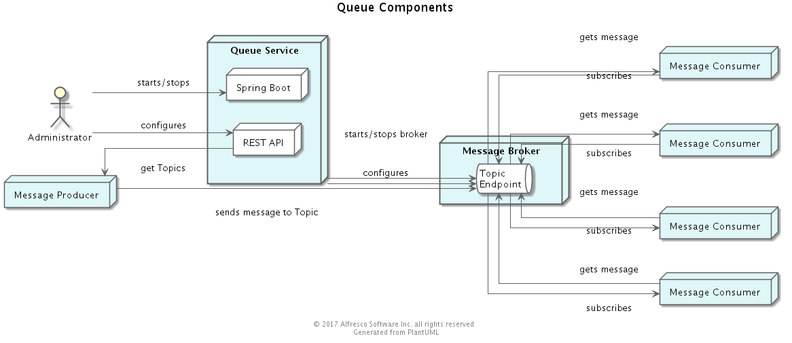
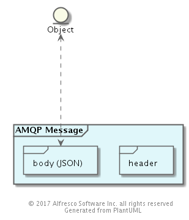
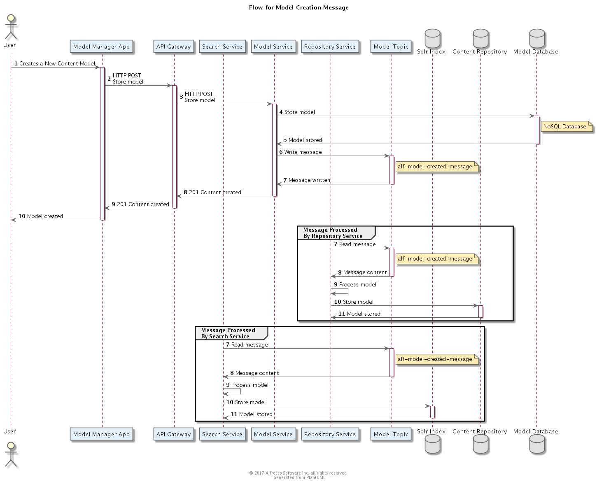
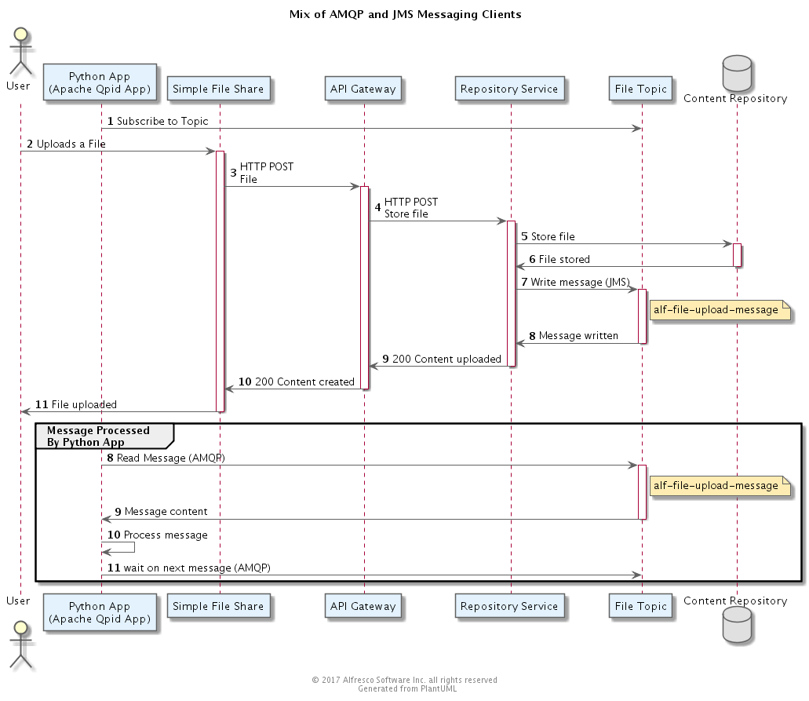

## Queue

### Purpose
The Queue Component is designed to meet the needs to asynchronous operations.
*** 

### Overview 
The Queue Component manages a set of **Queues** and **Topics** that enable Alfresco components to communicate with each other asynchronously using Messages. 

*** 

### Artifacts and Guidance

* Source Code Link: Not yet known
* License: Not yet known
* Issue Tracker Link: Not yet known
* Documentation Link: Not yet known
* Contribution Model: undetermined

*** 

### Prerequisite Knowledge
* [Apache Camel](http://camel.apache.org/)
* [Java Message Service](http://docs.oracle.com/javaee/6/tutorial/doc/bncdq.html)
* [AMQP](http://www.amqp.org/)

*** 

### Design

#### Technology Options

##### JMS and AMQP

There are two alternatives for client interactions with the Queue:
 [JMS](http://docs.oracle.com/javaee/6/tutorial/doc/bncdq.html) and [AMQP](https://www.amqp.org/) .  

JMS standardizes access at the API layer, thus making it easy to develop Java messaging clients.
AMQP standardizes the wire protocol, making it possible to develop clients in other programming languages.

The design is assuming the use of JMS by the Alfresco services for the following reasons:

1. Wider Adoption among brokers, in particular by AWS SNS should we decide to support that broker
2. Simpler client model for Java, which is an advantage since most of Alfresco is written in Java

However, ActiveMQ supports both JMS access and AMQP.  So, when ActiveMQ is used as the message broker, 
a client can use AMQP or JMS.  This allows a wider range of clients to be developed, such as C and Python clients.
The [Apache Messaging Toolkit](http:/qpid.apache.org/proton/) provides a useful set of libraries that make it easy to 
develop such clients,

##### Message Broker

There are a number of alternative implementations available for the Message Broker.  These include ActiveMQ, Rabbit MQ, AWS SNS and others.   This design is assuming ActiveMQ for the following reasons:

1.  It has the most capability
2.  Friendly License
3.  We have the most knowledge of the technology 

See the article [Distributed Queues](https://ts.alfresco.com/share/page/site/eng/wiki-page?title=Distributed_Queues) for a more complete discussion.

#### Delivery Mode

All Messages are sent as *persistent*.  This means that the broker will assure that it survives the life of the broker by writing the message to disk (See *Security Considerations*).

#### Subscription Policy

Subscriptions to Topics are typically *durable* to assure that Message Consumers receive all messages, even when the Message Consumer is not active.  
But no enforcement of that Subcription policy is done by this component.

#### Embedded Message Brokers

In addition to using this component for messaging, other components may embed a Message Broker in order to manage internal messages.  These internal brokers are not part of the responsibility of this component.   

#### Component Model

#### Data Model

##### Queues

*Queues* are used to send a Message from one Message Producer to one Message Consumer.  Thus, they enable a *point-to-point* style of communication.  This design does not use *Queues* (despite the component name).

##### Topics

*Topics* are used to send a Message from one Message Producer to multiple Message Consumers.  A Message Producer writes the Message to a Topic.  Message Consumers, which subscribe to the *Topic*, receive the Messages.   Thus, *Topics* enable a *pub/sub* style of communication.  This design assumes messages send via *Topics*

Topics are organized in the following hierarchy.   

* System (alf)
    * Content (alf.content)
        * Node (alf.content.node)
        * File (alf.content.file)
        * Folder (alf.content.folder)
        * Site (alf.content.site)
        * Comment (alf.content.comment)
        * Rating (alf.content.rating)
        * Rendition (alf.content.rendition)
    * Identity
        * User (alf.identity.user)
        * Group (alf.identity.group)
        * System (alf.identity.system)
    * Model (alf.model)
    * Tag (alf.tag)
    * Job (alf.job)
    * Preference (alf.preference)
    * Workflow (alf.workflow)
        * Process (alf.workflow.process)
        * Task (alf.workflow.task)

This will allow Message Consumers to be selective when deciding what Messages to listen for.  For example, the Audit component can subscribe to all changes in the System by subcribing to **alf.*** whereas the Transform component may only subscribe to **alf.content.file.*** messages 

##### Messages 

###### Format

The Structure of Messages adhere to the *Alfresco Message Style Guidelines*. 
 We need to define where that Guideline document is.

Each Message consists two parts:
* Header
* Body

###### Header
The header contains system information common to all Messages, such as the time it was sent and the kind of Message it is.  Additionally, the header contains the following Alfresco-specific information, stored as keyword/value properties [**Note:** Some of this information will be provided in the *Alfresco Message Style Guidelines*.
* **alf.version**: The Version of the Message in x.y format where x is a major version and y is a minor version.  
* **alf.sequenceNumber**: An integer generated by the component that can be used to order messages

###### Body  

The body contains the Message payload specified as a JSON object.  In a JMS client, that body is of type *javax.jms.TextMessage*.  On the wire (AMQP) it is an *AmqpValue* holding a String.

#### Data Dictionary
Not Applicable

### Flows

#### Example of a message created by one service and used by two others

#### Example of how a mix of AMQP and JMS clients can access a message topic

#### Class Diagram
 
*** 

### APIs and Interfaces

#### Message Registry

The Message Registry is defined in a yaml file that conforms to the [OpenAPI Specification](https://github.com/OAI/OpenAPI-Specification). 

See [Alfresco Message Explorer](https://github.com/Alfresco/message-explorer/blob/master/README.md)

##### REST API
 
We will use Swagger for specifying the REST API.  For now, here are the services:
* **Get Topics**
* **Register Topic**
<pre>
POST /topics
{
  "endpointName": "alf.content.file.v1.create",
  "endpointType": "topic"
  "messageSchema": "org.alfresco.message.file.v1.FileCreate"
}
</pre>

 Do we need this REST API at all?
* rgauss: I believe in the current design consumers of messages are talking directly to the broker.  Those consumers must also have been coded to know how to deal with the message schema of the endpoint they wish to listen to.  Do we expect these topic names to change per deployment?  If not, then I think they should be treated much like a REST URL in that it's helpful for developers to have documentation in the form of a topic explorer to learn about them, but that may not require that various components register their endpoints via another REST API.
* rgauss: If we do need a method of registering endpoints, we've also discussed the possibility of allowing that registration to happen via messaging rather than REST.  A microservice could periodically send a type of heartbeat message containing its endpoint data to a known topic which the queue service could consume.  This has a few advantages:
    * The queue service would not be required to persist the list of endpoints.  After queue service restart it would just gather the heartbeat data again and the microservices would not have to be notified of a queue service restart, asking them to re-register.
    * Eliminates the need for a 'de-register' endpoint as the endpoint data can be expired if it's not seen in heartbeat messages after some time.

#### Client API

##### Java 
[JMS provides the Java API](http://docs.oracle.com/javaee/1.4/api/javax/jms/package-summary.html) 

##### Python 
[Apache Messaging Toolkit - Python](http://qpid.apache.org/releases/qpid-proton-0.14.0/proton/python/api/index.html) 

##### C/C++ 
[Apache Messaging Toolkit - C API](http://qpid.apache.org/releases/qpid-proton-0.14.0/proton/c/api/files.html)

 
More API Bindings are available, if the broker supports AMQP.

*** 

### Configuration

*** 

### Performance Considerations
 Add a link to a list of Requirement Specifications that describe the key performance goals for this component.

*** 

### Security Considerations
* Authentication
    * Nothing should be made available without authentication.  Message Producer and Consumers must be authenticated.  Additionally, each Queue and Topic has an access control policy that controls who can read, write and delete messages.  All stored
    passwords will be stored in an encrypted manner (http://activemq.apache.org/encrypted-passwords.html).  
* Authorisation
    * The general principle here is that of least privilege.   Each Queue and Topic has an access control policy that controls who can read, write and delete messages.
* Encryption
    * Queue communications should be encrypted throughout. Additionally certificate based authentication also brings extra security gains (http://activemq.apache.org/how-do-i-use-ssl.html).
* Access 
    * Since Messages are sent as persisted, the Broker will write them to disk to assure they will survive a Broker crash. 
    Care must be taken to assure the disks the Message Broker uses to persist the messages are not accessible by unauthorized users.

*** 

### Cloud Considerations

An important design topic will be to decide what queue provider to support when the component is deployed to Cloud.   When deploying to AWS, consideration should be given to using **SNS** and **SQS**.
***

### Design Decisions

| Decision        | Rationale                  | Date         |
| :----------------|:--------------------------| ------------:|
| Use JSON for the message body, not Java serialization| (a) Simpler for Engineers to understand  (b) more portable across multiple client languages | 22 Sept, 2016 |
| Clients will subscribe directly to the topics to listen for changes as opposed to providing an endpoint for Alfresco to write to| (a) Simpler for clients since they don't need to create an endpoint  (b) more scalable because Alfresco is not a potential bottleneck in needing to post events to multiple endpoints | 03 Oct, 2016 |
| Spring Boot will be used to build the Container |  See https://issues.alfresco.com/jira/browse/TAG-11 and https://issues.alfresco.com/jira/browse/TAG-12 | 03 Oct, 2016 |
| Each topic will carry messsages pertaining to a single data type (e.g. User Object) |  Simpler for tooling to serialize/deserialize objects from a topic (e.g. using the "@class" annotation) | 10 Oct, 2016 |
| Each topic will carry messsages pertaining to a version of the message format | Simpler for message consumers to only consume messages of a particular version | 10 Oct, 2016 |
| Each message will also carry a version id, nothwithstanding the fact that the topic should only carry messages of a particular type and version | We cannot be certain that message producers will be completely reliable | 10 Oct, 2016 |
| It will be possible for a microservice to register a Topic to the Queue service | (a)Allows a new microservice to be introduced dynamically (b)Eliminates need for microservices to depend on a particular version of the Queue Service | 10 Oct, 2016 |
| The version will be encoded in the package name, e.g. **org.alfresco.message.file.v1.FileCreate** and in the header (to allow filtering)|   | 13 Oct, 2016 |
*** 

### Quiz

   
