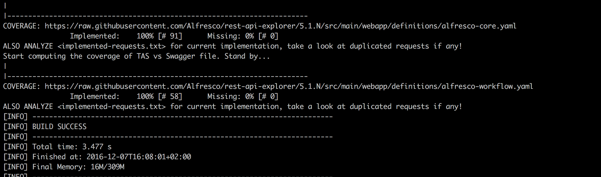

Back to [TAS Master Documentation](https://git.alfresco.com/tas/alfresco-tas-utility/wikis/home)

---
## Table of Contents
* [Synopsis](#synopsis)
* [Prerequisite](#prerequisite)
* [Installation](#installation-if-you-want-to-contribute)
* [Package Presentation](#package-presentation)
* [Sample Usage](#sample-usage)
    * [How to write a test](#how-to-write-a-test)
    * [How to generate models or check coverage](#how-to-generate-models-or-check-coverage)
    * [How to run tests?](#how-to-run-tests)
        * [from IDE](#from-ide)
        * [from command line](#from-command-line)
* [Listeners](#listeners)
* [Test Results](#test-results)
* [Test Rail Integration](#test-rail-integration)
    * [Configuration](#configuration)
    * [How to enable Test Rail Integration?](#how-to-enable-test-rail-integration)
* [Reference](#reference)
* [Change Log](docs/CHANGELOG.md) 🌟
* [Contributors](#contributors)
* [Releasing](#releasing)
* [License](#license)

## Synopsis

**TAS**( **T**est **A**utomation **S**ystem)- **RESTAPI** is the project that handles the automated tests related only to [Alfresco REST API](http://docs.alfresco.com/5.1/pra/1/topics/pra-welcome.html).

It is based on Apache Maven, compatible with major IDEs and is using also Spring capabilities for dependency injection.

As a high level overview, this project makes use of the following functionality useful in automation testing as:
* reading/defining test environment settings (e.g. alfresco server details, authentication, etc.)
* managing resource (i.e. creating files and folders)
* test data generators (for site, users, content, etc)
* helpers (i.e. randomizers, test environment information)
* test logging generated on runtime and test reporting capabilities
* test management tool integration (at this point we support integration with [Test Rail](https://alfresco.testrail.net) (v5.2.1)
* health checks (verify if server is reachable, if server is online)
* generic Internal-DSL (Domain Specific Language)

Using Nexus -Release Repository, everyone will be able to use individual interfaces in their projects by extending the automation core functionalities.

**[Back to Top ^](#table-of-contents)**

## Prerequisite
(tested on unix/non-unix destribution)
* [Java SE 1.8](http://www.oracle.com/technetwork/java/javase/downloads/index.html).
* [Maven 3.3](https://maven.apache.org/download.cgi) installed and configure according to [Windows OS](https://maven.apache.org/guides/getting-started/windows-prerequisites.html) or [Mac OS](https://maven.apache.org/install.html).
* Configure Maven to use Alfresco alfresco-internal repository following this [Guide](https://ts.alfresco.com/share/page/site/eng/wiki-page?title=Maven_Setup).
* Your favorite IDE as [Eclipse](https://eclipse.org/downloads/) or [InteliJ](https://www.jetbrains.com/idea).
* Access to [Nexus](https://nexus.alfresco.com/nexus/) repository.
* Access to Gitlab [TAS](https://gitlab.alfresco.com/tas/) repository.
* GitLab client for your operating system. (we recommend [SourceTree](https://www.sourcetreeapp.com) - use your google account for initial setup).
* Getting familiar with [Basic Git Commands](http://docs.gitlab.com/ee/gitlab-basics/basic-git-commands.html).
* Getting familiar with [Maven](https://maven.apache.org/guides/getting-started/maven-in-five-minutes.html).
* Getting familiar with [Spring](http://docs.spring.io).
* Getting familiar with [TestNG](http://testng.org/doc/index.html)

**[Back to Top ^](#table-of-contents)**

## Installation (if you want to contribute)

* Open your Gitlab client and clone the repository of this project.
* You can do this also from command line (or in your terminal) adding:

```bash
$ git clone https://git.alfresco.com/tas/alfresco-tas-restapi-test.git
# this clone will have the latest changes from repository. If you want to checkout a specific version released, take a look at the [Change Log](docs/CHANGELOG.md) page
$ cd alfresco-tas-tester
# this command will checkout the remove v2.0.0 tagged repository and create locally a new branch v2.0.0
$ git checkout tags/v2.0.0 -b v2.0.0 

```

* Install and check if all dependencies are downloaded

```bash
> cd alfresco-tas-restapi-test
> mvn clean install -DskipTests
# you should see one [INFO] BUILD SUCCESS message displayed
```
**[Back to Top ^](#table-of-contents)**

## Package Presentation

The project uses a maven layout [archetype](https://maven.apache.org/plugins-archives/maven-archetype-plugin-1.0-alpha-7/examples/simple.html):
```ruby
├── pom.xml
├── report.html
├── src
│   ├── main
│   │   └── java
│   │       └── org
│   │           └── alfresco
│   │               └── rest
│   │                   ├── core
│   │                   │    ├── assertion
│	│                   │    │   ├── IModelAssertion.java
│   │                   │    │   ├── IModelsCollectionAssertion.java
│   │                   │    │   ├── (...)
│   │                   │    │   └── PaginationAssertionVerbs.java
│   │                   │    ├── swagger
│   │                   │    │   ├── Generator.java
│   │                   │    │   ├── RestModelProperty.java
│   │                   │    │   ├── (...)
│   │                   │    │   └── SwaggerYamlParser.java
│   │                   │    ├── IRestModel.java
│   │                   │    ├── IRestModelsCollection.java
│   │                   │    ├── (...)
│   │                   │    ├── RestResponse.java
│   │                   │    └── RestWrapper.java
│   │                   ├── exception
│   │                   │   ├── EmptyJsonResponseException.java
│   │                   │   ├── EmptyRestModelCollectionException.java
│   │                   │   └── JsonToModelConversionException.java
│   │                   ├── model
│   │                   │    ├── builder	              
│   │                   │    │   └── NodesBuilder.java
│   │                   │    ├── RestActivityModel.java
│   │                   │    ├── RestActivityModelsCollection.java
│   │                   │    ├── (...)
│   │                   │    └── RestVariableModelsCollection.java
│   │                   ├── requests
│   │                   │    ├── authAPI	              
│   │                   │    │   └── RestAuthAPI.java
│   │                   │    ├── coreAPI
│   │                   │    │   └── RestCoreAPI.java
│   │                   │    ├── workflowAPI
│   │                   │    │   └── RestWorkflowAPI.java
│   │                   │    ├── Deployments.java
│   │                   │    ├── (...)
│   │                   │    └── Tenant.java
│   │                  
│   ├── test
│   │   ├── java
│   │   │   └── org
│   │   │       └── alfresco
│   │   │           └── rest
│   │   │               ├── auth
│   │   │               │    └── AuthTests.java
│   │   │               ├── comments
│   │   │               │    ├── AddCommentCoreTests.java
│   │   │               │    ├── (...)  
│   │   │               ├── (...)     
│   │   │               ├── workflow
│   │   │               │    ├── deployments    
│   │   │               │    │    ├── DeleteDeploymentCoreFullTests.java
│   │   │               │    │    ├── (...)          
│   │   │               │    ├── processDefinitions
│   │   │               │    │    ├── GetProcessDefinitionCoreTests.java
│   │   │               │    │    ├── (...)    
│   │   │               │    ├── (...)
│   │   │               ├── FunctionalCasesTests.java
│   │   │               └── RestTest.java
│   │   └── resources
│   │       ├── alfresco-restapi-context.xml
│   │       ├── default.properties
│   │       └── log4j.properties
```

**[Back to Top ^](#table-of-contents)**

## Sample Usage

Following the standard layout for Maven projects, the application sources locate in src/main/java and test sources locate in src/test/java.
Application sources consist in defining the REST API object that simulates the calls: get, post, put, delete.
The tests are based on an abstract object: Rest.java that handles the common behavior: checking the health status of the test server, configuration settings, getting the general properties, etc.

Please take a look at [RestDemoTests.java](src/test/java/org/alfresco/rest/demo/RestDemoTests.java) class for an example.

Common configuration settings required for this project are stored in properties file, see [default.properties](src/test/resources/default.properties).
Please analyze and update it accordingly with Alfresco test server IP, port, credentials, etc.

Example:
```java
# Alfresco HTTP Server Settings
alfresco.scheme=http
alfresco.server=<add-here-the-ip-of-your-test-server>
alfresco.port=<default-port-for-alfresco-not-share>
```

* optional update the logging level in  [log4j](src/test/resources/log4j.properties) file (you can increase/decrease the deails of the [logging file](https://logging.apache.org/log4j/1.2/manual.html), setting the ```log4j.rootLogger=DEBUG``` if you want.)
* go to [running](#how-to-run-tests) section for more information on how to run this tests.

**[Back to Top ^](#table-of-contents)**

### How to write a test

* Please also take a look at the [Rest-API desing and implementation](https://ts.alfresco.com/share/page/site/eng/document-details?nodeRef=workspace://SpacesStore/9f7823e7-0597-4435-9fd1-6ec8a4791259) guidelines.
* Tests are organized in java classes and located on src/test/java as per maven layout.
* One test class should contain the tests that cover one functionality as we want to have a clear separation of test scope: tests for sanity/core/full, tests that verify manage of folder/files etc.
* These are the conventions that need to follow when you write a test:
    * The test class has @Test annotation with the group defined: rest-api. You can add more groups like sanity, regression

      ```java
      @Test(groups={ TestGroup.COMMENTS}
      ```

   * The test has @TestRail annotation in order to assure that the details and results will be submitted on TestRail. The fields for TestRail annotation will be explained on next chapter.


      ```java
    @TestRail(section={TestGroup.REST_API, TestGroup.PEOPLE}, executionType= ExecutionType.SANITY,
            description = "Verify admin user gets person with Rest API and response is not empty")
    public void adminShouldRetrievePerson() throws Exception
    {
        peopleAPI.getPerson(userModel.getUsername())
            .assertResponseIsNotEmpty();

        restClient.assertStatusCodeIs(HttpStatus.OK.toString());
    }

      ```

   * Use Spring capabilities to initialize the objects(Models, Wrappers) with @Autowired

   * To view a simple class that is using this utility, just browse on [RestDemoTests.java]((src/test/java/org/alfresco/rest/demo/RestDemoTests.java)
    Notice the class definition and inheritance value:

    ```java        
        public class RestDemoTest extends RestTest
    ```

   * as a convention, before running your test, check if the test environment is reachable and your alfresco test server is online.
    (this will stop the test if the server defined in your property file is not healthy - method available in parent class)

    ```java
        @BeforeClass(alwaysRun = true)
    public void setupRestTest() throws Exception{
        serverHealth.assertServerIsOnline();
        }
    ```
   * the test name are self explanatory:

    ```java
    @TestRail(section={TestGroup.REST_API, TestGroup.SITES}, executionType= ExecutionType.SANITY,
            description = "Verify admin user gets sites with Rest API and status code is 200")
    public void adminShouldRetrieveSites() throws JsonToModelConversionException, Exception
    {
        siteAPI.getSites();
        restClient()
            .assertStatusCodeIs(HttpStatus.OK.toString());
    }
    ```
* Asserting on imbricated keys:

Let's say your response is something like:

```json
{"entry": {
   "createdAt": "2017-08-01T12:01:24.979+0000",   
   "edited": false,   
   "modifiedBy": {
      "firstName": "Administrator"
   }   
}}
```

if you want to assert that firstName is "Administrator" you can do that using the following DSL:

```java
restClient.onResponse().assertThat().body("entry.modifiedBy.firstName", org.hamcrest.Matchers.is("Administrator"));
```

(notice that i'm using Hamcrest Matcher to finalize this assertion)

**[Back to Top ^](#table-of-contents)**

### How to generate models or check coverage

There are some simple generators that could parse [Swagger YAML](http://docs.alfresco.com/community/concepts/alfresco-sdk-tutorials-using-rest-api-explorer.html) files and provide some usefull information to you like:
 
a) Show on screen the actual coverage of TAS vs requests that exists in each YAML file - defined in pom.xml) 

```bash
mvn exec:java -Dcoverage 
```
Any missing request are saved under "missing-requests```<yaml-file-name>```.txt" file for further analysis
All current implementation are saved under "implemented-requests```<yaml-file-name>```.txt"


b) Generate all missing models

```bash
mvn exec:java -Dmodels
```

This command will read all definitions of models from swagger YAML file predefined in pom.xml file.
It will compare with this file pattern: 'Rest```<model-definition-name>```Model.java', file created under  ```/src/main/java/org/alfresco/rest/model``` ignoring the ones that are specified in [ignore-models](src/main/java/org/alfresco/rest/model/ignore-models) file.


At this time you you will be prompted to select (based on displayed ID) what models you want to generate (separate each one by comma).
(you can also skip the generation of models from select yaml file or generate all missing models)


c) Generate specific models
Maybe you want to generate/regenerate just one model or multiple ones.

```bash
mvn exec:java -Dmodels=Error,SiteModel
```

This command will parse the Swagger YAML file, and will generate the definition of only those specified models, even if those models exist locally (in this case you will be prompted to override that file or not)

_NOTE_: there are some fields that are marked as ```required``` in swagger file. We also generate those fields with annotation ```@JsonProperty(required = true)```

All models are generated based on a [freemarker](http://freemarker.org) template found [here](src/main/resources/rest-model.ftl).

### How to run tests

#### from IDE

* The project can be imported into a development environment tool (Eclipse or IntelliJ). You have the possibility to execute tests or suite of tests using  [TestNG plugin](http://testng.org/doc/eclipse.html) previously installed in IDE.

* In case you are using the default settings that points to localhost (127.0.0.1) and you don't have Alfresco installed on your machine, you will see one exception thrown (as expected):
    ```java
    org.alfresco.utility.exception.ServerUnreachableException: Server {127.0.0.1} is unreachable.
    ```

#### from command line

* In terminal or CMD, navigate (with CD) to root folder of your project (you can use the sample project):


  The tests can be executed on command line/terminal using Maven command

    ```bash
  mvn test
    ```

  This command with trigger the tests specified in the default testng suite from POM file: <suiteXmlFile>src/main/resources/shared-resources/restapi-acs-community-suite.xml</suiteXmlFile>

  You can use -Dtest parameter to run the test/suites through command line (http://maven.apache.org/surefire/maven-surefire-plugin/examples/single-test.html).

  You can also specify a different suiteXMLFile like:

  ```bash
  mvn test -DsuiteXmlFile=src/resources/your-custom-suite.xml
  ```

  Or even a single test:

  ```bash
  mvn test -Dtest=org.alfresco.rest.RestDemoTest
  ```
  But pay attention that you will not have enabled all the [listeners](#listeners) in this case (the Reporting listener or TestRail integration one)

**[Back to Top ^](#table-of-contents)**

## Listeners

  With the help of Listeners we can modify the behavior of TestNG framework. There are a lot of testNG listener interfaces that we can override in order to provide new functionalities.
  The TAS framework provides out of the box a couple of listeners that you could use. These could be enabled and added at the class level or suite level.

### a)  org.alfresco.utility.report.ReportListenerAdapter

 * if added at the class level:

    ```java
    @Listeners(value=ReportListenerAdapter.class)
    public class MyTestClass extends RestTest
    {
     (...)
    }
    ```

 * or suite xml level

    ```java
    <suite name="Your Suite test" parallel="classes">
	<listeners>
		<listener class-name="org.alfresco.utility.report.ReportListenerAdapter"></listener>
	</listeners>
    (...)
    </suite>
    ```
    It will automatically generate one html named "report.html" in ./target/report folder.
    Please also take a look at [Test Results](#test-results) section.

### b) org.alfresco.utility.testrail.TestRailExecutorListener
   It will automatically update Test Rail application with the test cases that you've automated.
   Please take a look at [Test Rail Integration](#test-rail-integration) section for more details.

### c) org.alfresco.utility.report.log.LogsListener
This is a new listener that will generate further details in one XML format of the automated test steps that you will write.

Example:

```java
public void myDSLMethod1()
{
    STEP("Lorem ipsum dolor sit amet");
    //code for first step

    STEP("consectetur adipiscing elit");
    //code for the next description
}

public void myDSLMethod2()
{
    STEP("sed do eiusmod tempor incididunt ut labore");
    //code for first step

    STEP("et dolore magna aliqua");
    //code for the next description
}
```

If these methods will be executed insite a test method, all those steps will be automatically logged in the XML report generated.
Example:

```java
@Test
public void adminShouldCreateFileInSite()
{
    myDSLMethod1();
    myDSLMethod2()
}
```

So if "testingSomething" will be executed this is what you will see on the XML file generated. (please take a look at [Test Results](#test-results) section for defining the defaul location)

Here is one example of XML file generated with these steps:


**[Back to Top ^](#table-of-contents)**

## Test Results
  We already executed a couple of tests using command line as indicated above. Sweet! Please take a look at [rest-suites.xml](src/main/resources/shared-resources/restapi-acs-community-suite.xml) one more time.
  You will see there that we have one listener added:

  ```java
<listener class-name="org.alfresco.utility.report.HtmlReportListener"></listener>
  ```
  This will tell our framework, after we run all tests, to generate one HTML report file with graphs and metrics.

  Take a look at the target/reports folder (created after running the tests) and open the report.html file.

  

  Playing with this report, you will notice that you will be able to:
    * search tests cases by name
    * filter test cases by errors, labels, groups, test types, date when it was executed, protocol used, etc.
    * view overall pass/fail metrics of current test suite, history of tests execution, etc.

  The report path can be configured in default.properties):

    ```
        # The location of the reports path
        reports.path=your-new-location-of-reports
    ```    

**[Back to Top ^](#table-of-contents)**

## Test Rail Integration

Alfresco is using now https://alfresco.testrail.net (v5.3.0.3601).

We aim to accelerate the delivery of automated test by minimizing the interaction with the test management tool - TestRail. In this scope we developed the following capabilities:
* creating automatically the manual tests in TestRail
* submitting the test results (with stack trace) after each execution into TestRail Test Runs
* adding the test steps for each test.

### Configuration
In order to use Test Rail Integration you will need to add a couple of information in [default.properties](src/test/resources/default.properties) file:
(the document is pretty self explanatory)

```java
# Example of configuration:
# ------------------------------------------------------
# testManagement.enabled=<true/false>
# testManagement.endPoint=https://alfresco.testrail.com/
# testManagement.username=<yourusername-that-you-connect-to-testrail>
# testManagement.apiKey=<api-key>
# testManagement.project=<id-of-your-project
# testManagement.includeOnlyTestCasesExecuted=<true/false>
# testManagement.rateLimitInSeconds= 1
# testManagement.testRun=<test-run-name>
# testManagement.suiteId=<suite-id>
```
!This settings are already defined in default.properties for you.


For generating a new API Key take a look at the official documentation, TestRail [APIv2](http://docs.gurock.com/testrail-api2)
* _testManagement.project= **<id-of-your-project**_ this is the ID of the project where you want to store your test cases.
 If you want to use [Alfresco ONE](https://alfresco.testrail.net/index.php?/projects/overview/1) project in TestRail, open that project and notice the URL, after "/overview/**1**" link you will see the ID of the project (1 in this case)
 If you want to use [TAS Project](https://alfresco.testrail.net/index.php?/projects/overview/7) you will notice the ID 7, so _"testManagement.project=7"_
* "_testManagement.testRun=<test-run-name>_" this represents the name of the Test Run from your project.
* In Test Rail, navigating to Test Runs & Results, create a new Test Run and include all/particular test cases. If this test run name is "Automation", update _testManagement.testRun= **Automation**_.
  All test results will be updated only on this test run at runtime as each test is executed by TAS framework.

### How to enable Test Rail Integration?

We wanted to simplify the Test Rail integration, so we used listeners in order to enable/disable the integration of Test Rail.
* first configure your default.properties as indicated above

* now on your TestNG test, add the @TestRail annotation, so let's say you will have this test:

  ```java
   @Test(groups="sample-tests")
   public void thisAutomatedTestWillBePublishedInTestRail()
   {
   }
  ```
  add now @TestRail integration with mandatory field ```section```. This means that this tests annotated, will be uploaded in TestRail:

   ```java
   @Test(groups= TestGroup.REST_API, TestGroup.FULL,)
   @TestRail(section = {TestGroup.REST_API, TestGroup.PROCESSES })
   public void thisAutomatedTestWillBePublishedInTestRail()
   {
   }
  ```
  The section field, represents an array of strings, the hierarchy of sections that SHOULD be found on TestRail under the project you've selected in default.properties. Follow the TestRail [user-guide](http://docs.gurock.com/testrail-userguide/start) for more information regarding sections.
  In our example we created in Test Rail one root section "restAPI" with a child section: "processes" (you can go further and add multiple section as       you wish)

* now, lets add the listener, the TestRailExecutorListener that will handle this TC Management interaction.
  This listener can be added at the class level or suite level (approach that we embrace)
  Take a look at   [restapi-acs-community-suite.xml](src/main/resources/shared-resources/restapi-acs-community-suite.xml) for further example.

  ```xml
  <listeners>
  <listener class-name="org.alfresco.utility.report.HtmlReportListener"></listener>
   (...)
  </listeners>
  ```

  Right click on sanity-suite.xml file and run it, or just "mvn test" from root if this sample project.
  After everything passes, go in Test Rail, open your project and navigate to "Test Cases" section. Notice that under restApi/processes section, you will see your test case published.

  If you defined also the "testManagement.testRun" correctly, you will see under Test Runs, the status of this case marked as passed.

  The @TestRail annotation offers also other options like:
  - "description" this is the description that will be updated in Test Rail for your test case
  - "testType", the default value is set to Functional test
  - "executionType", default value is set to ExecutionType.REGRESSION, but you can also use ExecutionType.SMOKE, ExecutionType.SANITY, etc

  Take a look at the demo scenarios in this project for further examples.

**[Back to Top ^](#table-of-contents)**

## Reference

* For any improvements, bugs, please use Jira - [TAS](https://issues.alfresco.com/jira/browse/TAS) project.
* Setup the environment using [docker](https://gitlab.alfresco.com/tas/alfresco-docker-provisioning/blob/master/Readme.md).
* [Bamboo Test Plan](https://bamboo.alfresco.com/bamboo/browse/TAS-RESTAPI)

## Contributors

As contributors and maintainers of this project, we pledge to respect all people who contribute through reporting issues, posting feature requests, updating documentation, submitting pull requests or patches, and other... [more](CODE_OF_CONDUCT.md)

## Releasing

Any commit done on this project should be automatically executed by [TAS Build Plan](https://bamboo.alfresco.com/bamboo/browse/TAS-TAS)
If the build passes, then you didn't broke anything.

If you want to perform a release, open [TAS-RestAPI](https://bamboo.alfresco.com/bamboo/browse/TAS-RESTAPI) Bamboo Build.
Run the Default stage and if it passes, then manually perform the Release stage (this will auto-increment the version in pom.xml)
