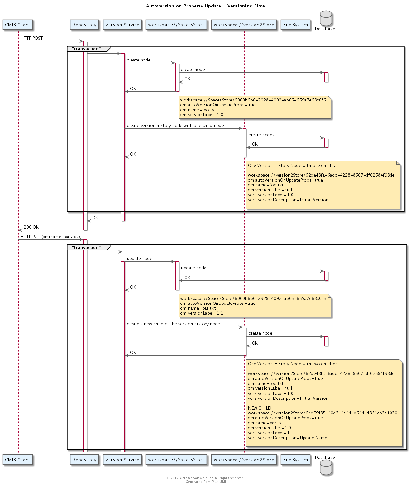

## Versions


### Purpose

***

### Overview

***

### Artifacts and Guidance

* Source Code Link:m https://svn.alfresco.com/repos/alfresco-enterprise/alfresco/
* License: LGPL
* Issue Tracker Link: https://issues.alfresco.com/jira/secure/RapidBoard.jspa?projectKey=REPO&useStoredSettings=true&rapidView=379
* Documentation Link: http://docs.alfresco.com/5.1/concepts/versioning.html
* Contribution Model: Alfresco publishes the source code and will review proposed patch requests
***


### Prerequisite Knowledge

***

### Design

#### Component Model

#### Data Model

#### Data Dictionary

#### Flows

This is a series of flows illustrating when versions are created, based on changes to content and metadata.

##### No Autoversion on Property Updates
Suppose the defaults in the _cm:versionable_ aspect are set as follows:
```
version.store.enableAutoVersioning=true
version.store.enableAutoVersionOnUpdateProps=false
```
Note this is the default case when Alfresco is installed.


##### Autoversion on Property Updates
Suppose the defaults in the _cm:versionable_ aspect are set as follows:
```
version.store.enableAutoVersioning=true
version.store.enableAutoVersionOnUpdateProps=true
```



#### Class Diagram

***

### APIs and Interfaces

***

### Configuration

#### What is Versioned
Whether an object is versionable at all is governed by the presence of the _cm:versionable_ aspect.
If the aspect is present, the object is versioned.  Otherwise it is not versioned.

#### Autoversioning

Sometimes it is desirable to create a version automatically.  Whether this happens is controlled by two variables in the _cm:versionable_ aspect:

* cm:autoVersion
* cm:autoVersionOnUpdateProps


When _cm:autoVersion_ is true, a new version is created when the _cm:content_ of a content node changes.
When _cm:autoVersionOnUpdateProps_ is true, a new version is created when any of the properties of a content node change.

The defaults for these properties are set in the contentModel.xml file in the usual way.  But to simplify the admin experience, the values of these properties can also be set using global properties:
* version.store.enableAutoVersioning
* version.store.enableAutoVersionOnUpdateProps

If the values are found in the properties file they have the effect of overriding what may have been set in the contenModel.xml file.

The effect of these properties can be overridden by Share using a set of two properties:

* autoVersion
* autoVersionProps

The values of these overrides are contained in the file _upload.post.config.xml_ such as in this example
```
<autoVersion>true</autoVersion>
<autoVersionProps>false</autoVersionProps>
```

***

### Performance Considerations
***

### Security Considerations
***

### Cloud Considerations
None

***

### Design Decisions

***
