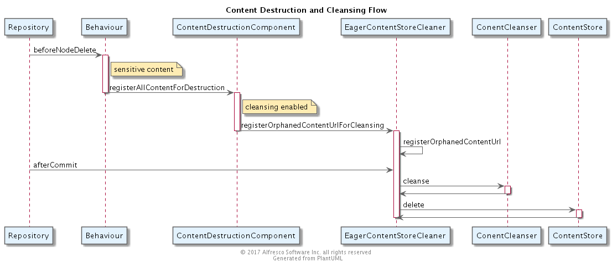
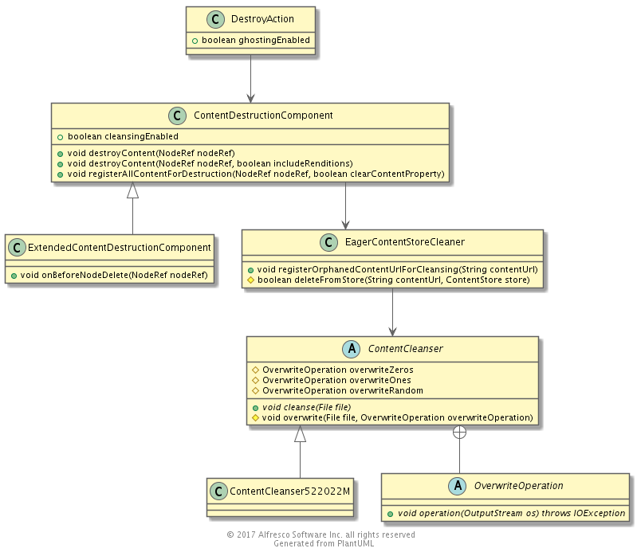

## Destruction

### Purpose

Ensure the immediate and permanent destruction of sensitive content.

This includes:

 * Records
 * Classified content

### Overview 

Sensitive content is immediately deleted from the content store.  It does not get added to the trashcan or any other recoverable location and as such should not be recoverable.

It is possible to configure the component to include a cleansing step prior to content deletion.  This allows the binary content to be repeatedly overwritten prior to deletion to make it harder to forensically recover the binary data.

Recorded content can be explicitly destroyed whilst maintaining the original node and associated meta-data.  This is configured as a characteristic of the destruction step within a retention schedule.

### Artifacts and Guidance

* Source Code Link: [GitHub](https://github.com/Alfresco/records-management)
* License: Alfresco Community
* Issue Tracker Link: [JIRA RM](https://issues.alfresco.com/jira/projects/RM/summary)
* Contribution Model: Alfresco Closed Source
* Documentation: [docs.alfresco.com (Records Management)](http://docs.alfresco.com/rm2.4/concepts/welcome-rm.html)

*** 

### Design

#### Component Model

#### Content Model
 
* uri - http://www.alfresco.org/model/recordsmanagement/1.0
* prefix - rma
* rma:ghosted - aspect that indicates that a records content has been destroyed, but the records meta-data is still available.

#### Flows

#### Class Diagram

*** 

### Interfaces and APIs

*** 

### Configuration

*** 

### Considerations

*** 
