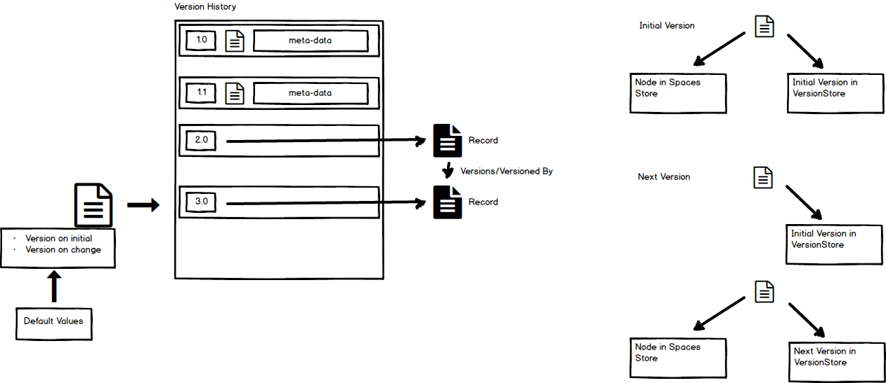

## Version Records 

### Notes: 

NodesService varies depending on store. Version Service has a different service that hydrates effectively fake nodes (which contain url, version details, associations, aspects, as denormalised meta data) back into a full node

Recorded Versions take content out of version store and create a record by version store implementation extension.

Declaring record as version - standard use case is auto declaring or via records. Head version is extracted to a record, rather than a new version being created

Records are linked by association

Disposition events can be triggered automatically from versioning events.

### Diagram:

